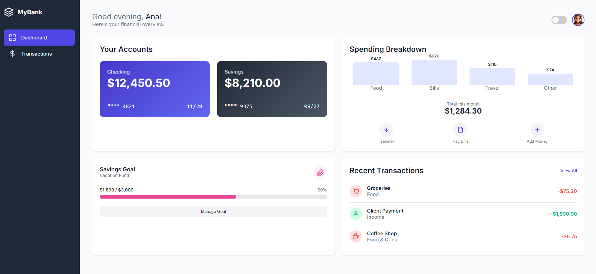

# Financial Dashboard

Financial Dashboard is a front-end project for a clean and modern personal banking application. It provides users with a clear overview of their financial status on a main dashboard and a detailed log of all their transactions. This project was built using HTML, CSS, and JavaScript.

## Pages

The project consists of two main pages:

1.  **Dashboard (`dashboard.html`):** The main landing page after a user logs in. It features:
    *   An overview of the current balance, income, and expenses.
    *   A list of recent transactions.
    *   Navigation to other sections of the application.
2.  **Transactions (`transactions.html`):** A page that displays a complete history of all transactions, allowing the user to review their spending and income over time.

## Features

-   **Responsive Design:** The layout is fully responsive and works on various devices, from mobile phones to desktop computers.
-   **Dynamic Data:** JavaScript is used to populate the dashboard and transaction lists, simulating data from a real backend.
-   **Clean UI/UX:** The design focuses on clarity and ease of use, making financial data easy to understand at a glance.

## Technologies Used

-   HTML5
-   CSS3
-   JavaScript

## How to Use

To view the project, open the `dashboard.html` file in your web browser. You can navigate to the transactions page from the dashboard.